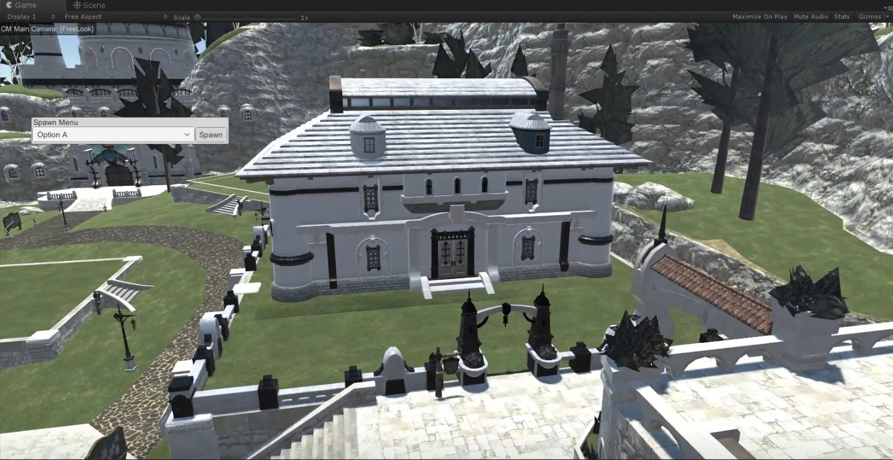

Note: This project is now deprecated in favor of the in-game housing preview functionality. I'll be using the knowledge (and some code) from this project to create a Unity-based generic map viewer for the game soon.

# FFXIVHousingSim
The current release should be considered pre-alpha and contains exploratory code not really meant for actual use.
The goal of this project is to develop a housing simulator for Final Fantasy 14. Its current design uses a WPF-based asset exporter and a Unity-based map viewer.

In-game there are a variety of customization options for the exterior and interior of the home, as well as yard objects and indoor furniture. In the current retail version of FFXIV, there is no ability to preview these items unless someone obtains them and takes screenshots, or places them in their public home.

## Main goals
- Extraction of FFXIV models for use with the Unity project
- Extraction of necessary FFXIV data such as model positions and housing fixtures for use with the Unity project
- Loading of assets such as the two above
- Ability to select an in-game plot to add a house at similar to retail FFXIV
- Ability to customize the exterior of the house with different fixtures as well as their color
- Ability to place any yard object at any plot
- Ability to customize the interior of the house with different fixtures
- Ability to place any furnishings in the interior of any house

## Current state
The project is being actively developed by myself. It uses [ufx's fork of SaintCoinach](https://github.com/ufx/SaintCoinach) with a very minor fix of mine for reading game assets.

Currently, the project has some functionality including (assume all functionality is incomplete):
- Extraction of FFXIV models for use with the Unity project
- Extraction of necessary FFXIV data such as model positions and housing fixtures for use with the Unity project
- Loading of assets such as the two above
- Rudimentary plot selection and camera movement
- Early implementation of housing exterior loading

## How to use it
0. Make sure you have the game installed and updated.
1. Clone the repository, clone the submodule
2. Open the SaintCoinach solution and restore the NuGet packages, then build SaintCoinach.
3. Open the FFXIVHSLauncher solution and restore the NuGet packages.
Change the string 'root' in `FFXIVHSLib.FFXIVHSPaths` to point to the folder you'd like the programs to use and build the solution.
If the reference to UnityEngine.dll is broken, at the top of Visual Studio, click Tools > NuGet Package Manager > Package Manager Console. Once it appears, enter `Add-Unity3DReference -AssemblyName UnityEngine -ProjectName FFXIVHSLib` and press enter. If this doesn't work, make sure you restored the NuGet packages.
A post-build script copies FFXIVHSLib.dll to the Unity project. If this doesn't take place, copy it manually.
4. Select a territory and click all buttons under 'Extract', but click '__Extract Map JSON__' and '__Ext Housing JSON__' __twice__. This is what extracts models.
5. Open the Unity project by opening the folder "FFXIVHousingSim" in the root directory of the repository you cloned. Click File > Open > Navigate into Scenes > MainScene.unity.
6. You may need to install the asset store packages used in the project. Open the asset store from Window > General > Asset Store and search for and import "json.net".
Click Window > Package Manager. In the top left, click the "All" tab. Click Cinemachine in the left list box. Click "Install" in the top right.
6. Change the ward to your extracted ward in `StartupScript.cs` and click Play.
6. After a few seconds you should have a loaded map! If you want to play around with exterior fixtures, modify the ward folder's `Landset.json` file by hand and relaunch the 'game'.

The above documentation may be incorrect at any time and is untested. Visual Studio is used for the Launcher, and JetBrains Rider is used for the Unity code.
